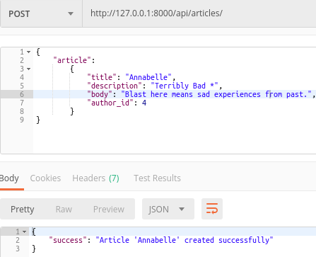
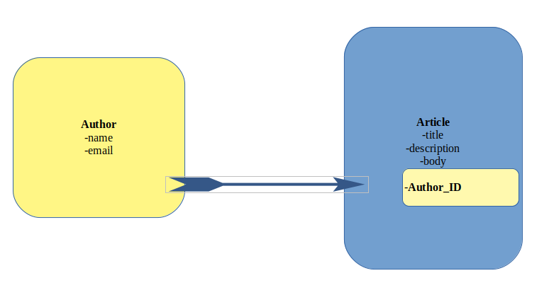

# Django_rest_framework
A simple DRF for basic CRUD operations

URLs → views → serializers → models

# URLS
/articles -> To Handle Get and Post requests.

/articles/<int:pk>/ -> To Handle Put and Delete requests.

/authors -> To Handle Get and Post requests.

/authors/<int:pk>/ -> To Handle Put and Delete requests.

# views

from rest_framework.views import APIView

class AuthorView(APIView):

...

class ArticleView(APIView):

...

# serializers

from rest_framework import serializers

class AuthorSerializer(serializers.Serializer):

...

class ArticleSerializer(serializers.Serializer):

...

# models

from django.db import models

class Author(models.Model):

...

class Article(models.Model):

...
